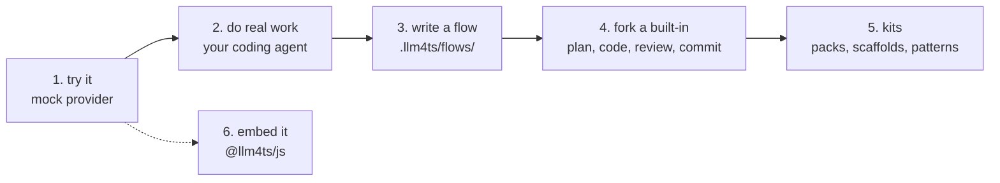

# llm4ts

Effect-native LLM workflows for TypeScript: typed connectors for API
providers and CLI coding agents, streaming, structured output, tools, plans
and review loops, repository automation, trace replay, and a Node runner.
`llm4ts` is the TypeScript implementation of
[`llm4zio`](https://github.com/riccardomerolla/llm4zio).

The whole library climbs one ladder, and so does this README: each step
below is the first screen of a chapter in the
[getting started guide](docs/guide/README.md).



## Try it in one minute

Node 22 or newer, nothing to install, no credentials: the built-in `hello`
flow talks to the mock provider.

```bash
npx -y @llm4ts/shell run hello "What is llm4ts?"
```

`npx -y @llm4ts/shell doctor` shows which coding agents and providers your
machine has; `npm i -g @llm4ts/shell` makes the command `llm4ts`. More:
[chapter 1](docs/guide/01-install.md).

## Do real work

The `implement` flow plans a task, then implements, reviews, and commits it
one task at a time, and resumes where it stopped. Point it at a throwaway
repository and the coding agent you have installed:

```bash
LLM4TS_CODER=codex llm4ts run implement "Add a multiply function next to add, with tests"
```

`LLM4TS_CODER` is `claude` (default), `codex`, `gemini`, `pi`, `agy`,
`grok`, `cursor`, or `opencode`; the CLI must be installed and logged in.
Every task is a commit on the flow's branch, the plan lives under
`.llm4ts/` in that repository, and re-running the same command resumes it.
`llm4ts list` shows the other built-ins: `sdd`, `issue-pr`, `epic-stories`,
the `modernize-*` phases. More: [chapter 2](docs/guide/02-run-a-flow.md).

## Write a flow

A flow is one TypeScript file in `.llm4ts/flows/` of the directory you
launch from. Copy the built-in and it is yours:

```bash
mkdir -p .llm4ts/flows && llm4ts view hello > .llm4ts/flows/hello.ts
```

<!-- prettier-ignore -->
```ts
// Hello: send one prompt to the configured provider and print the answer.
import * as Effect from "effect/Effect"
import {
  apiConnectorFromEnvironment,
  completeAndPublish,
  resolveFlowInput,
  runFlowMain,
  runNode
} from "@llm4ts/runner"

const program = Effect.gen(function* () {
  const input = yield* resolveFlowInput("Say hello and name one thing you can do.")
  const coder = yield* apiConnectorFromEnvironment()
  yield* runNode(
    {
      workDir: input.workDir,
      workspace: input.workspace,
      userPrompt: input.prompt,
      coder,
      environment: process.env
    },
    (context) => completeAndPublish(context.coder, context.events, input.prompt)
  )
})

runFlowMain(program)
```

No `npm install`: the shell resolves `@llm4ts/runner` and `effect` from its
own installation. `runNode` wires HTTP, processes, temp files, persistence,
and connectors, so you never assemble Effect layers; swap
`apiConnectorFromEnvironment()` for `coderFromEnv(process.env)` and the same
prompt goes to your coding agent. More:
[chapter 3](docs/guide/03-your-first-flow.md).

## Fork a built-in

```bash
llm4ts view implement > .llm4ts/flows/my-implement.ts
```

Change the system prompt, add review lenses, a lint gate, a formatter, or
the number of review rounds: they are fields of one options object passed to
`implementPlanFlow`. The
[flow authoring guide](docs/flow-authoring.md) goes deeper, down to custom
task loops. More: [chapter 4](docs/guide/04-fork-a-built-in.md).

## Kits

The `modernize-*` flows rewrite a legacy code base in six phases and know
nothing about any technology. Everything stack-specific comes from a
**kit**: pack manifests with prompts and review lenses, the scaffolds they
seed a target from, translation pattern cards, and stack-only flows. Two
ship built in, `mainframe-java` (COBOL/JCL and ACE to Spring Boot and Kafka
Streams) and `j2ee-nextjs` (JSP to Next.js); yours go under `.llm4ts/kits/`.

```bash
llm4ts kits
llm4ts run modernize-pack-check --pack cobol-springboot --repo /path/to/legacy-estate
```

The check loads a pack and matches its rules against the estate without a
model call. More: [chapter 5](docs/guide/05-your-first-pack.md) and
[kits/](kits/README.md).

## Embed it

To call an LLM from your own program, `@llm4ts/js` is a Promise client
over the same connectors:

```js
import { createClient } from "@llm4ts/js"

const client = createClient({ provider: "mock", model: "mock" })
const response = await client.complete("Hello")
console.log(response.content)
```

Swap `provider` for `openai`, `anthropic`, `gemini`, `lm-studio`, or
`ollama`; API keys are read from the standard environment variables and
never appear in argv, logs, traces, or error messages. Effect programs use
`runNode` directly; the [examples](examples/README.md) show both.

## Your coding agent can use llm4ts too

Three skills teach Claude Code, Pi, OpenCode, and Codex to work with
llm4ts: [using-llm4ts](skills/using-llm4ts/README.md) hands a task to
`llm4ts run`, [authoring-llm4ts-flows](skills/authoring-llm4ts-flows/README.md)
writes and forks flows, and
[authoring-llm4ts-packs](skills/authoring-llm4ts-packs/README.md) writes
packs and checks them. Install from this repository's plugin marketplace or
by copying a skill directory.

## Packages

| Package          | Purpose                                                     |
| ---------------- | ----------------------------------------------------------- |
| `@llm4ts/shell`  | `llm4ts` CLI and menu over discovered flows and kits        |
| `@llm4ts/runner` | Node runner; its root export is the flow author's barrel    |
| `@llm4ts/flow`   | Plans, events, persistence, repositories, review, packs     |
| `@llm4ts/core`   | Models, connectors, providers, tools, eval, observability   |
| `@llm4ts/js`     | Promise-based client for calling an LLM from any JS program |

## Configuration

Everything is environment-driven; nothing is required for the mock provider.

| Variable                                                | Effect                                                                                         |
| ------------------------------------------------------- | ---------------------------------------------------------------------------------------------- |
| `LLM4TS_CODER`                                          | Coding agent: `claude` (default), `codex`, `gemini`, `pi`, `agy`, `grok`, `cursor`, `opencode` |
| `LLM4TS_PROVIDER` / `LLM4TS_MODEL`                      | API provider and model for provider-driven flows such as `hello`                               |
| `LLM4TS_PACK`                                           | Pack for the modernization flows, also `llm4ts run --pack`                                     |
| `OPENAI_API_KEY`, `ANTHROPIC_API_KEY`, `GEMINI_API_KEY` | Provider credentials, applied automatically                                                    |
| `LLM4TS_VERBOSITY`                                      | Terminal verbosity                                                                             |

See the [configuration guide](docs/configuration.md) for the full list.

## Working on this repository

```sh
pnpm install
pnpm typecheck && pnpm lint && pnpm format:check && pnpm test
pnpm build
node scripts/pack-smoke.mjs   # verifies the published artifacts
```

Layout: `packages/` (the library), `flows/` (the engine flows the shell
ships), `kits/` (the built-in kits), `examples/` (embedding scripts and
starters), `docs/`, `skills/`, `specs/` (the work queue), `tools/` (the
autonomous loop). Releases are tag-driven: bump every package to `X.Y.Z`,
tag `vX.Y.Z`, push, and the release workflow verifies, builds, smoke-tests
the packed tarballs, and publishes with provenance.

## Documentation

- [Getting started guide](docs/guide/README.md)
- [Flow authoring guide](docs/flow-authoring.md)
- [API guide](docs/api.md)
- [Architecture](docs/architecture.md)
- [Configuration](docs/configuration.md)
- [Provider capability matrix](docs/provider-capabilities.md)
- [Migration from llm4zio](docs/migration-from-llm4zio.md)
- [Kits](kits/README.md), [flows](flows/README.md), [examples](examples/README.md)

Internal engineering references: [source parity ledger](docs/parity.md),
[architecture decision records](docs/adr/),
[Clean Specification Pack](docs/csp/00-overview.md), [plan](plan.md).

## Status

1.0 since 2026-09-15; see [CHANGELOG.md](CHANGELOG.md) for what the 1.x
line holds stable: the package subpath exports, the `@llm4ts/runner` root
barrel, the flow and kit layouts and their three discovery tiers, the pack
manifest, and the `LLM4TS_*` environment. Importing package-private files is
unsupported. The implementation tracks the owned `llm4zio` v4.3.0 behaviour
and uses Effect 4 (beta line, pinned exactly).

Licensed under MIT.
