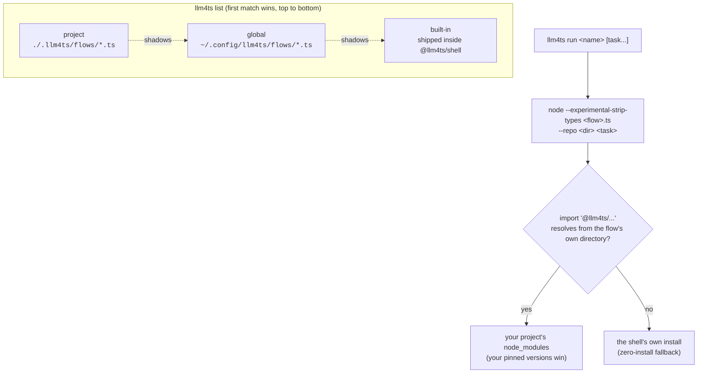

# 1. Install

llm4ts ships as the `llm4ts` command in the `@llm4ts/shell` package. Nothing
needs to be installed to try it:

```bash
npx -y @llm4ts/shell doctor
```

For a permanent command, install it globally; the rest of this guide writes
`llm4ts` and means either form:

```bash
npm i -g @llm4ts/shell
```

You need Node 22 or newer. Flows are TypeScript files that Node runs
directly with type stripping, so there is no build step anywhere in this
guide.

## Read the doctor report

`llm4ts doctor` probes every connector on your machine and prints three
lists: connectors with their health, the credential variables it looked for,
and any prerequisite a connector needs before a run can start.

```text
connectors:
  ✔ claude-cli     healthy  auth: valid
  ✔ codex          healthy  auth: valid
  ✖ gemini-api     unhealthy  auth: invalid
  ✔ mock           healthy  auth: valid

credentials:
  ✖ OPENAI_API_KEY
  ✖ ANTHROPIC_API_KEY

coder: claude
```

You need exactly one healthy coding agent CLI to follow chapter 2. The
`mock` connector is always healthy: it answers with canned text and is what
chapter 3 uses to prove a flow works before spending anything. An unhealthy
API provider is fine unless you plan to use it.

## Pick your coding agent

The last line of the report is the coder llm4ts will drive. It defaults to
`claude` and is chosen with one environment variable:

```bash
export LLM4TS_CODER=codex   # claude | codex | gemini | pi | agy | grok | cursor | opencode
```

The chosen CLI must be installed and authenticated on its own; llm4ts never
sees your credentials and never passes them on the command line.

## See what you can run

```bash
llm4ts list
```

```text
implement            [builtin]  Persistent plan: plan the task, then implement, review, and commit one task at a time.
issue-pr             [builtin]  GitHub issue to pull request: assess the issue, plan, implement, push, and open a PR.
sdd                  [builtin]  Spec-driven development: write a specification, encode it as red tests, implement to green.
...
```

Each row is a flow: a name, the tier it was found in, and the first comment
line of its source. `llm4ts view implement` prints that source. Flows are
discovered in three tiers, and a name in a higher tier shadows the same name
below it:



The bottom half is why chapter 3 needs no `npm install`: a flow that lives in
`.llm4ts/flows/` resolves `@llm4ts/*` and `effect` from wherever the shell
itself is installed, unless your project pins its own copies.

`llm4ts` with no arguments opens an interactive menu over the same list; it
needs a real terminal. `llm4ts --help` shows every subcommand and flag.

Next: [2. Run a flow](02-run-a-flow.md).
