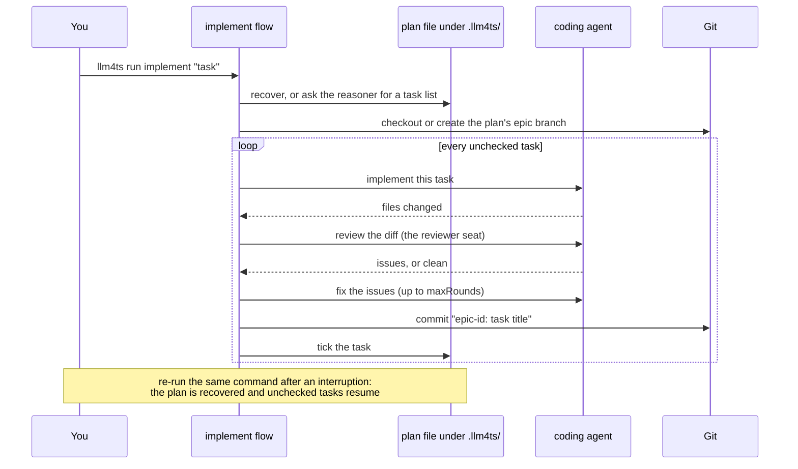

# 2. Run a flow

The built-in `implement` flow is the one to watch first: it plans a task,
then implements, reviews, and commits one task at a time, and it resumes if
you stop it. Run it on a throwaway repository so nothing you care about is
touched.

## Make a disposable repository

Any small git repository works. This one is enough:

```bash
mkdir hello-llm4ts && cd hello-llm4ts && git init -q -b main
printf 'export const add = (a, b) => a + b\n' > calc.mjs
git add -A && git commit -qm "baseline"
```

If you cloned the llm4ts repository instead, `examples/seed.sh implement`
copies a starter project, commits a baseline, and prints the exact command
to run next; `--run` starts it immediately.

## Run implement

```bash
LLM4TS_CODER=codex llm4ts run implement "Add a multiply function next to add, with a node:test test file"
```

`run` takes the flow name, then the task text. `--repo <dir>` targets another
directory (the default is the current one) and `--verbose` streams the
agent's tool calls as they happen. The terminal shows each stage start and
end, the assistant's messages, tool calls as `● run_shell_command (...)`,
and a token and cost summary at the end.

## What happened



Two files under `.llm4ts/` in the target repository carry the state:

- **`plan-<hash>.md`** is the plan, keyed by a hash of the task text. Each
  task is a `## [ ] title` heading that becomes `## [x]` when its commit
  lands. Edit it by hand between runs if the plan is wrong.
- **`trace-<timestamp>.jsonl`** records every event of the run for replay.

Every task is its own commit on the flow's branch, so `git log` on that
branch is the story of the run and `git diff main` is the whole change.

## Exit codes and resuming

| Code | Meaning                                                      |
| ---- | ------------------------------------------------------------ |
| 0    | Every task completed and was committed                       |
| 1    | A stage failed (a review that never came clean, a gate, ...) |
| 2    | Usage error: unknown flow, unknown coder, missing argument   |

After a 1, read the last stage's message, fix what it names, and run the
same command again. Completed tasks are not redone.

## The other built-ins

| Flow           | Add to what you just saw                                        | Needs                  |
| -------------- | --------------------------------------------------------------- | ---------------------- |
| `sdd`          | A written spec, red tests first, then implementation to green   | a coding agent + Maven |
| `issue-pr`     | Reads a GitHub issue, ends with a pushed pull request           | GitHub remote and `gh` |
| `epic-stories` | Splits an epic into stories run by parallel coders in worktrees | a reasoner CLI + pi    |
| `local`        | LM Studio reasons, a local pi agent implements                  | LM Studio + pi         |
| `modernize-*`  | The six-phase legacy modernization pipeline                     | a pack, see chapter 5  |

`llm4ts view <flow>` prints any of them; [flows/README.md](../../flows/README.md)
describes each in full.

Next: [3. Your first flow](03-your-first-flow.md).
