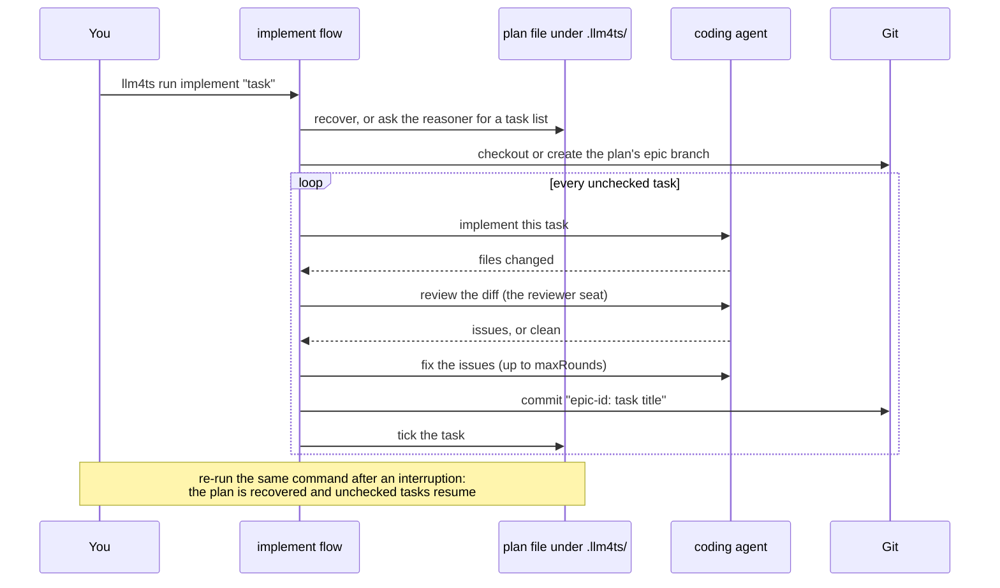

# 2. Run a flow

The built-in `implement` flow is the one to watch first: it plans a task,
then implements, reviews, and commits one task at a time, and it resumes if
you stop it. Run it on a throwaway repository so nothing you care about is
touched.

## Make a disposable repository

Any small git repository works. This one is enough:

```bash
mkdir hello-llm4ts && cd hello-llm4ts && git init -q -b main
printf 'export const add = (a, b) => a + b\n' > calc.mjs
git add -A && git commit -qm "baseline"
```

If you cloned the llm4ts repository instead, `examples/seed.sh implement`
copies a starter project, commits a baseline, and prints the exact command
to run next; `--run` starts it immediately.

## Run implement

```bash
LLM4TS_CODER=codex llm4ts run implement "Add a multiply function next to add, with a node:test test file"
```

`run` takes the flow name, then the task text. `--repo <dir>` targets another
directory (the default is the current one) and `--verbose` streams the
agent's tool calls as they happen. The terminal shows each stage start and
end, the assistant's messages, tool calls as `● run_shell_command (...)`,
and a token and cost summary at the end.

## What happened


```mermaid
sequenceDiagram
  participant You
  participant Flow as implement flow
  participant Plan as plan file under .llm4ts/
  participant Coder as coding agent
  participant Git
  You->>Flow: llm4ts run implement "task"
  Flow->>Plan: recover, or ask the reasoner for a task list
  Flow->>Git: checkout or create the plan's epic branch
  loop every unchecked task
    Flow->>Coder: implement this task
    Coder-->>Flow: files changed
    Flow->>Coder: review the diff (the reviewer seat)
    Coder-->>Flow: issues, or clean
    Flow->>Coder: fix the issues (up to maxRounds)
    Flow->>Git: commit "epic-id: task title"
    Flow->>Plan: tick the task
  end
  Note over You,Plan: re-run the same command after an interruption:<br/>the plan is recovered and unchecked tasks resume
```

Three files under `.llm4ts/` in the target repository carry the state:

- **`plan-<hash>.md`** is the plan, keyed by a hash of the task text. Each
  task is a `## [ ] title` heading that becomes `## [x]` when its commit
  lands. Edit it by hand between runs if the plan is wrong.
- **`trace-<timestamp>.jsonl`** records every event of the run for replay,
  including every token report with its timestamp.
- **`costs.jsonl`** gains one record per run that reported usage: when it
  started, the prompt's first line, and the tokens and cost per stage,
  agent, and model.

## Budgeting from past runs

```bash
llm4ts costs
```

reads every trace under `.llm4ts/` and prints tokens and cost per day, per
hour, per run, and per model, plus the peak day and hour. `--repo <dir>`
(repeatable) reads other repositories, `--since 2026-09-01` narrows the
window, `--tz Europe/Rome` cuts the day and hour buckets in your zone, and
`--runs-per-day 5` adds a projected daily figure for the run rate you
expect. `--json` emits the same report as data.

Measured token counts and estimates are never mixed: every seat is metered, so
a seat that reports no usage is counted from characters under the model label
`estimated:<model>` (see [configuration](../configuration.md)), and the
report keeps those in their own column. Costs come from the backend when it
reports them, otherwise from the pricing table, whose date the report
prints.

A flow's own commits never stage the trace or the ledger, but `git status`
still lists them until the repository ignores them:

```gitignore
.llm4ts/trace-*.jsonl
.llm4ts/costs.jsonl
.llm4ts/transcripts/
```

(Not the whole directory: forked packs live under `.llm4ts/kits/` and are
meant to be committed.)

Every task is its own commit on the flow's branch, so `git log` on that
branch is the story of the run and `git diff main` is the whole change.

## Watching a run: the agent tree

A run with several stories in flight (`epic-stories` on an executor roster)
is easier to follow as a tree than as a scrolling log. Add `--ui tree` to
`llm4ts run` and the terminal shows, full-screen, the orchestrator, the
judge's latest verdict, one box per running story with the executor that
holds it, every other story as a status chip, the judge seat, a session
log, and the run's tokens and estimated cost:

```text
                        LLM4TS AGENT TREE  ·  epic conto-bonifico
══════════════════════════════════════════════════════════════════════════════════════════

┌────────────────────────┐          ┌─ epic conto-bonifico ──────────────────────┐
│       JUDGE SEAT       │          │ stage  implement stories                   │
│    claude · on call    │          │ stories 6  elapsed 7m10s                   │
│                        │          └────────────────────────────────────────────┘
│ last verdict:          │                                •
│ » accounts r2: cleared │  ┌─ JUDGMENT · accounts r2 ───────────────────────────────────┐
│                        │  │ provides        ██████████  2/2                            │
│ reviews            1   │  │ scope           ██████████  2/2                            │
│ verdicts           2   │  │ house-style     ██████████  2/2                            │
└────────────────────────┘  │ tests           ██████████  2/2                            │
                            │ cleared → merge                                            │
                            └────────────────────────────────────────────────────────────┘
                                            delegate to roster · 2 running
                                                          ▼
                            ┌────────────────────────────┐  ┌────────────────────────────┐
                            │ payments                   │  │ overview                   │
                            │ pi-lmstudio                │  │ codex                      │
                            │ Payments fake routes       │  │ story overview: setup      │
                            │ bash pnpm typecheck && pn… │  │ read src/features/conto/p… │
                            │ 7m06s · 92.5k tok          │  │ 29s · 0 tok                │
                            │ ◐ running                  │  │ ◐ running                  │
                            └────────────────────────────┘  └────────────────────────────┘

                            ✓ accounts  ◐ payments  ✗ iban  ◐ overview  · movimenti
                            ◌ bonifico

┌─ session log ──────────────────────────────────────────────────────────────────────────┐
│ 00:05:30  judge            accounts r1 · 1 issue → coder                               │
│ 00:06:35  judge            accounts r2 · cleared → merge                               │
│ 00:06:39  accounts         merged into epic/conto-bonifico                             │
│ 00:06:40  accounts         done                                                        │
│ 00:06:42  roster           codex → coder · overview                                    │
└────────────────────────────────────────────────────────────────────────────────────────┘
stories [1/6 done · 2 running · 1 failed · 1 waiting]  roster [2/4 busy]
tokens [383.5k]  cost [~$0.38]  run [live]
```

Keys: `↑`/`↓` or `1`–`9` select a story, `enter` expands it (its stages and
last tool calls), `e` switches to one column per executor, `l` shows the
whole log, `q` hands the screen back to the classic view while the run goes
on. `ctrl-c` still aborts. Off a terminal, below 90 columns, or with
`NO_COLOR` set, the classic view is used.

`llm4ts watch` draws the same tree from a trace file, from another terminal
or after the run: `llm4ts watch --epic <id>` opens an epic's latest run,
`llm4ts watch <trace>` a given one, and bare `llm4ts watch` the newest
trace in the repository. A live trace is followed as it grows; a finished
one shows its last frame; `--replay [--speed n]` plays it back on its own
timestamps. Piped, `watch` prints one frame and exits.

## Where the time goes: `llm4ts profile`

When stories take long, `llm4ts profile` says where the time went:

```bash
llm4ts profile --epic <id>      # an epic's latest run
llm4ts profile <trace.jsonl>    # a given trace; bare: the newest one
llm4ts profile --epic <id> --json > run.json   # to compare runs
```

Per story, its wall time is split into **model** (the seats' calls, less
the coder's own tool time), **coder tools**, **gates** (per command, with
re-runs and failures), **merge**, **waiting** (the merge lock, a free
executor) and what is left **unaccounted**. It also lists model calls by
role and executor (with time to first output, and the API and tool time the
Gemini CLI reports), the coder's turns and how much their prompts grew, and
the time each story queued before starting, the steps per coder turn and the
model's time per step, and the coder's tool time by kind of work (explore,
edit, test, build, install, git). It opens with the three biggest
sinks in plain words, for example ``gate `pnpm test`: 14 runs, 22m10s (31%
of story time), 3 failed``.

The report holds no prompts, replies, arguments or output: only story ids,
roles, executors, tool names, gate commands as configured, counts and
durations, so it can be shared from a customer's server. A trace written
before 2.22 has no timings; its report is estimated from the gaps between
events and says so.

During a run, the agent tree (`--ui tree`) shows the same numbers live: each
story's current activity and how long it has run, `turns · avg · gates`,
an **idle** marker on a story with no event and no tool running for
`LLM4TS_IDLE_AFTER` (default `2m`), and the run's split above the status
line: `time [model 62% · tools 5% · gates 24% · wait 9%]`.

## Tailing what a seat says: `--transcript`

To see what a story's coder, reviewer or judge is told and answers, start the
run with a transcript:

```bash
llm4ts run epic-stories --transcript --ui tree …
```

Every seat call is then recorded under `.llm4ts/transcripts/<run-id>/`, one
file per story: the input (a chat's system prompt and messages on its first
call, then only what is new), the reply as it streams, each tool call with its
result. Secrets are redacted, long parts capped, and the files are readable
only by their owner. The trace and `llm4ts profile` stay content-free: a
transcript is never part of them. Landing the epic deletes its earlier runs'
transcripts.

In the tree (live, or in `llm4ts watch`), select a story (or, in the executors
view, an executor) and press `t`: the boxes give way to its transcript,
following the end. `r` cycles the role shown (all, coder, reviewer, judge),
`PgUp`/`PgDn` scroll, `esc` closes it. From another terminal,

```bash
llm4ts watch --epic <id> --tail <story-or-executor>
```

prints it as it grows, like `tail -f`, until the run ends.

## Exit codes and resuming

| Code | Meaning                                                      |
| ---- | ------------------------------------------------------------ |
| 0    | Every task completed and was committed                       |
| 1    | A stage failed (a review that never came clean, a gate, ...) |
| 2    | Usage error: unknown flow, unknown coder, missing argument   |

After a 1, read the last stage's message, fix what it names, and run the
same command again. Completed tasks are not redone.

## The other built-ins

| Flow           | Add to what you just saw                                        | Needs                  |
| -------------- | --------------------------------------------------------------- | ---------------------- |
| `sdd`          | A written spec, red tests first, then implementation to green   | a coding agent + Maven |
| `issue-pr`     | Reads a GitHub issue, ends with a pushed pull request           | GitHub remote and `gh` |
| `epic-stories` | Splits an epic into stories run by parallel coders in worktrees | a reasoner CLI + pi    |
| `local`        | LM Studio reasons, a local pi agent implements                  | LM Studio + pi         |
| `modernize-*`  | The six-phase legacy modernization pipeline                     | a pack, see chapter 5  |

`llm4ts view <flow>` prints any of them; [flows/README.md](../../flows/README.md)
describes each in full.

Next: [3. Your first flow](03-your-first-flow.md).
