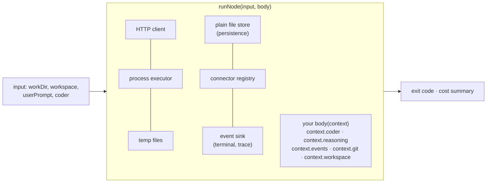

# 3. Your first flow

A flow is one TypeScript file in `.llm4ts/flows/` of any directory. The
shell discovers it by name, runs it with Node's type stripping, and resolves
its imports from the shell's own installation, so this chapter installs
nothing.

## Write it

Create `.llm4ts/flows/hello.ts` in an empty directory:

<!-- prettier-ignore -->
```ts
// Hello: send one prompt to the configured provider and print the answer.
import * as Effect from "effect/Effect"
import { completeAndPublish } from "@llm4ts/flow/Flow"
import { apiConnectorFromEnvironment } from "@llm4ts/runner/Connectors"
import { resolveFlowInput } from "@llm4ts/runner/FlowArgs"
import { runFlowMain, runNode } from "@llm4ts/runner/FlowRunner"

const program = Effect.gen(function* () {
  const input = yield* resolveFlowInput("Say hello and name one thing you can do.")
  const coder = yield* apiConnectorFromEnvironment()
  yield* runNode(
    {
      workDir: input.workDir,
      workspace: input.workspace,
      userPrompt: input.prompt,
      coder,
      environment: process.env
    },
    (context) => completeAndPublish(context.coder, context.events, input.prompt)
  )
})

runFlowMain(program)
```

## Run it offline

```bash
llm4ts list          # hello  [project]  Hello: send one prompt ...
llm4ts run hello "What is llm4ts?"
```

`LLM4TS_PROVIDER` is unset, so `apiConnectorFromEnvironment` picks the mock
provider and the answer is canned text. That is the point: the flow, its
discovery, and the run loop are proven before any key or agent is involved.

## Every line, once

- **The first `//` line** is the description `llm4ts list` shows. It must
  be the first non-blank line.
- **`resolveFlowInput(default)`** parses the arguments `llm4ts run` forwards:
  the task text, or `default` when there is none, and `--repo`. It returns
  `prompt`, `workDir` (the target repository) and `workspace` (where you
  launched from).
- **`apiConnectorFromEnvironment()`** reads `LLM4TS_PROVIDER` and
  `LLM4TS_MODEL`. `mock` needs nothing; `openai`, `anthropic`, `gemini`,
  `lm-studio`, and `ollama` need a model name and, for the cloud ones, the
  standard key variable.
- **`runNode(input, body)`** builds everything the body needs and hands it
  over as `context`. You never construct services or layers.
- **`completeAndPublish(service, events, prompt)`** sends one prompt and
  publishes the answer as an event the terminal renders.
- **`runFlowMain(program)`** runs the program, renders events, prints the
  cost summary, and sets the exit code.



## Point it at your coding agent

Replace one line, and add one import:

<!-- prettier-ignore -->
```ts
import { coderFromEnv } from "@llm4ts/runner/Connectors"
// ...
  const coder = coderFromEnv(process.env)
```

Now `llm4ts run hello "Summarise this repository in three lines"` sends the
prompt to the CLI named by `LLM4TS_CODER`, running inside `workDir`, with
the agent's tool calls streamed to your terminal. Everything else is
unchanged.

## Optional: editor types

The zero-install path gives you no autocompletion. When you intend to write
more than a hello flow, add the packages to the project that holds
`.llm4ts/flows/`:

```bash
npm i -D @llm4ts/runner @llm4ts/flow @llm4ts/core effect@beta
```

Your project's copies now win over the shell's fallback, so keep them on the
same versions as the shell, and keep `effect` pinned exactly rather than
with a caret: the Effect 4 line is a beta, and a caret range drifts past the
version llm4ts was built against.

Next: [4. Fork a built-in](04-fork-a-built-in.md).
