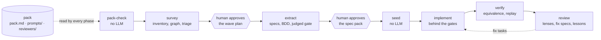
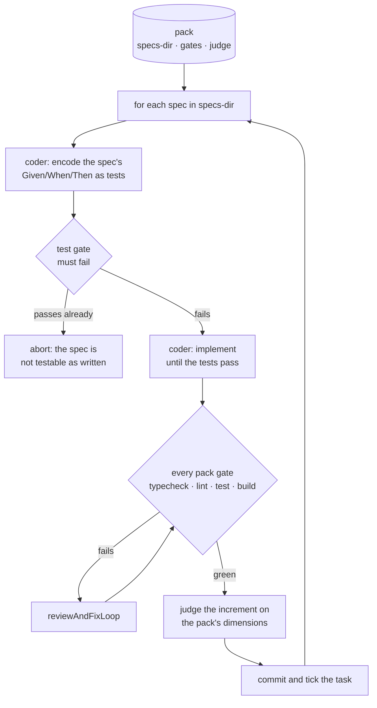

# 5. Your first pack

The `modernize-*` flows rewrite a legacy code base into a new stack in six
phases. They know nothing about COBOL, JSP, or your target: everything
stack-specific comes from a **pack**, a directory of one manifest and a few
Markdown sidecars. Writing a pack is how you point the pipeline at a new
technology, and this chapter gets one loading and matching before any model
is called.

## The phases and where the pack is read



Survey and extract run rooted at the legacy repository; seed onwards run at
the target, behind a clean-room wall that refuses to start if legacy source
is reachable there. [flows/README.md](../../flows/README.md#legacy-modernization)
covers each phase; this chapter covers the pack.

## The manifest

Create `packs/my-pack/pack.md` next to where you will launch from. The
smallest useful pack for a JSP estate:

```md
# Pack: my-pack

source: jsp
sources: ._\.(jsp|java|xml)
programs: ._\.jsp
specs-dir: docs/modernization/specs
features-dir: docs/modernization/features

## Gates

- test: pnpm test

## Judge

- completeness (0..2): Every screen, form field, and validation rule in the source is captured.
- faithfulness (0..2): Every statement is grounded in the source; nothing is invented.

## Coverage: jsp-form

files: .\*\.jsp
unit: action="([^"]+)"

## Survey: jsp-include

files: .\*\.jsp
unit: <jsp:include page="([^"]+)"
```

Header fields, one per line under the `# Pack:` title:

| Field          | Required | Meaning                                                                         |
| -------------- | -------- | ------------------------------------------------------------------------------- |
| `source`       | yes      | The legacy technology name, used in prompts and reports                         |
| `sources`      | no       | Regex over repo-relative paths: the files the estate consists of (default: all) |
| `exclude`      | no       | Regex removing paths from `sources`                                             |
| `programs`     | no       | Regex selecting the units extract writes one spec for (default: every source)   |
| `scaffold`     | no       | Pack-relative directory copied into an empty target by seed                     |
| `specs-dir`    | no       | Where specs land in the target (default `docs/specs`)                           |
| `features-dir` | no       | Where `.feature` files land (default `features`)                                |
| `replay`       | no       | Command verify runs to replay equivalence vectors                               |
| `programFiles` | no       | Regex template with `<NAME>` for the target files that belong to one program    |

Sections:

- **`## Gates`**: `- name: command` lines. Implement and verify run each one
  after every task and feed failures back to the coder.
- **`## Judge`**: `- name (0..max): rubric` lines. Extract scores every spec
  on these before the human sees it.
- **`## Coverage: <name>`** and **`## Survey: <name>`**: a `files:` regex and
  a `unit:` regex with one capture group. Coverage units must all appear in
  the traceability matrix; survey units are the edges of the dependency
  graph.
- **`## Equivalence`**: `- ordering: ordered|unordered|per-key` and
  `- ignore: field,field` for verify's comparison.

Sidecars next to the manifest: `prompts/<phase>.md` (`analysis`, `spec`,
`bdd`, `plan`, `implement`, `review`, `vectors`, plus `survey-refine` and
`survey-triage`) carry the stack-specific paragraph each phase's prompt
includes; `reviewers/<lens>.md` is a review lens with an optional
`files:` front-matter regex; `lessons.md` is appended by the review phase.
The six shipped packs under [flows/packs](../../flows/packs) are complete
examples to copy from.

## Check it without an LLM

```bash
LLM4TS_PACK=packs/my-pack llm4ts run modernize-pack-check --repo /path/to/legacy-estate
```

```text
  · pack 'my-pack' (source: jsp) at /work/packs/my-pack
  · gates: test → pnpm test
  · judge: 2 dimensions — completeness (0..2), faithfulness (0..2)
  · prompts: 0/7 phase sidecars
  · sources: 34 files match '.*\.(jsp|java|xml)' — pom.xml, src/main/java/... … +29 more
  · programs: 18 files match '.*\.jsp' — src/main/webapp/accountOverview.jsp, ... … +13 more
  · coverage 'jsp-form': 5 units — beneficiary, j_security_check, doTransfer, #, transfer
  · survey 'jsp-include': 3 units — header.jsp, footer.jsp, nav.jsp
  · warning: prompts/analysis.md not found (read by extract)
  · pack 'my-pack' check passed with 8 warnings — next: LLM4TS_PACK=packs/my-pack modernize-survey --repo /path/to/legacy-estate
```

The check loads the pack exactly as survey and extract do and matches every
rule against the estate. Read the samples: a coverage rule that captures
`#` is a regex worth tightening, and a rule that captures nothing is a
warning. A `sources:` or `programs:` regex that matches nothing is a
failure, since every later phase would have nothing to read. Iterate here;
it runs in milliseconds and costs nothing.

## Then run the pipeline

```bash
LLM4TS_PACK=packs/my-pack llm4ts run modernize-survey --repo /path/to/legacy-estate
```

Survey ends by asking you to approve its wave plan; extract ends by asking
you to approve the spec pack. Each phase names the next command in its last
line.

## Design your own phase flow

A pack is also the input for flows of your own. The shipped `sdd` flow is a
spec-first loop over one task; the same shape over a pack's specs directory
gives a test-driven implementation phase:



The pieces already exist as public exports: `openPack` in
`@llm4ts/runner/Packs` loads the pack, `pack.gate("test")` returns a gate
command, `stage`, `implementTaskLoop`, and `reviewAndFixLoop` in
`@llm4ts/flow` are the loop, and `flows/sdd.ts` is the reference for the
red-then-green ordering. Start from `llm4ts view sdd`, as chapter 4 did
with `implement`.

Next: [6. Troubleshooting](06-troubleshooting.md).
