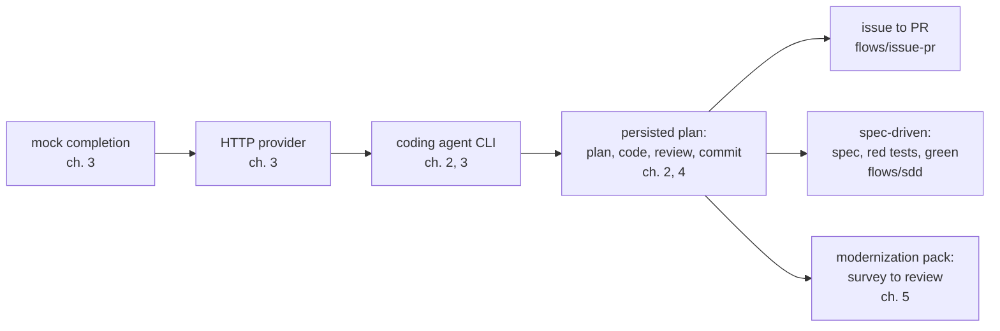

# Getting started with llm4ts

This guide is for a developer who has a coding agent installed (Claude Code,
Codex, Gemini CLI, Pi, ...) and wants to run llm4ts flows, then write their
own. It assumes TypeScript, not Effect: every call is explained where it
appears, and nothing here requires assembling Effect layers.

Read the chapters in order the first time. Each is one screen long and ends
where the next begins.

| Chapter                                     | You will                                                         | Needs              |
| ------------------------------------------- | ---------------------------------------------------------------- | ------------------ |
| [1. Install](01-install.md)                 | Run `llm4ts doctor` and `llm4ts list`                            | Node 22+           |
| [2. Run a flow](02-run-a-flow.md)           | Seed a disposable repo and watch `implement` plan, code, commit  | a coding agent     |
| [3. Your first flow](03-your-first-flow.md) | Run the built-in `hello`, copy it, point it at your coding agent | nothing            |
| [4. Fork a built-in](04-fork-a-built-in.md) | Copy `implement`, change its prompt and gates                    | a coding agent     |
| [5. Your first pack](05-your-first-pack.md) | Write a modernization pack, check it without an LLM, kit it      | a legacy code base |
| [6. Troubleshooting](06-troubleshooting.md) | Read `doctor`, fix the five errors newcomers hit                 |                    |

If you only want to call an LLM from a TypeScript program, the
[README quickstart](../../README.md#try-it-in-one-minute) and `@llm4ts/js`
are enough; come back here when you want a flow.

## The ladder

Everything in llm4ts climbs the same ladder, from a canned answer to a
multi-phase modernization. The chapters follow it left to right.

Rung by rung, the same three ideas recur:

- **A flow is one TypeScript file.** It imports `@llm4ts/runner`, `effect`,
  and `node:*`, and its first `//` comment line is its description.
- **`runNode` wires the world.** HTTP, processes, temp files, persistence,
  the connector registry: you receive a `context` and never build layers.
- **State lives under `.llm4ts/` in the target repository.** Plans, traces,
  and epics persist there, so an interrupted run resumes where it stopped.

## Where this guide stops

- [Flow authoring guide](../flow-authoring.md) is the deep reference for
  chapters 3 and 4: events, structured output, custom spines, testing.
- [flows/README.md](../../flows/README.md) is the catalogue of every shipped
  flow, and [examples/README.md](../../examples/README.md) the runnable
  scripts.
- [Configuration](../configuration.md) lists every environment variable;
  [Provider capabilities](../provider-capabilities.md) says which connector
  supports what.
